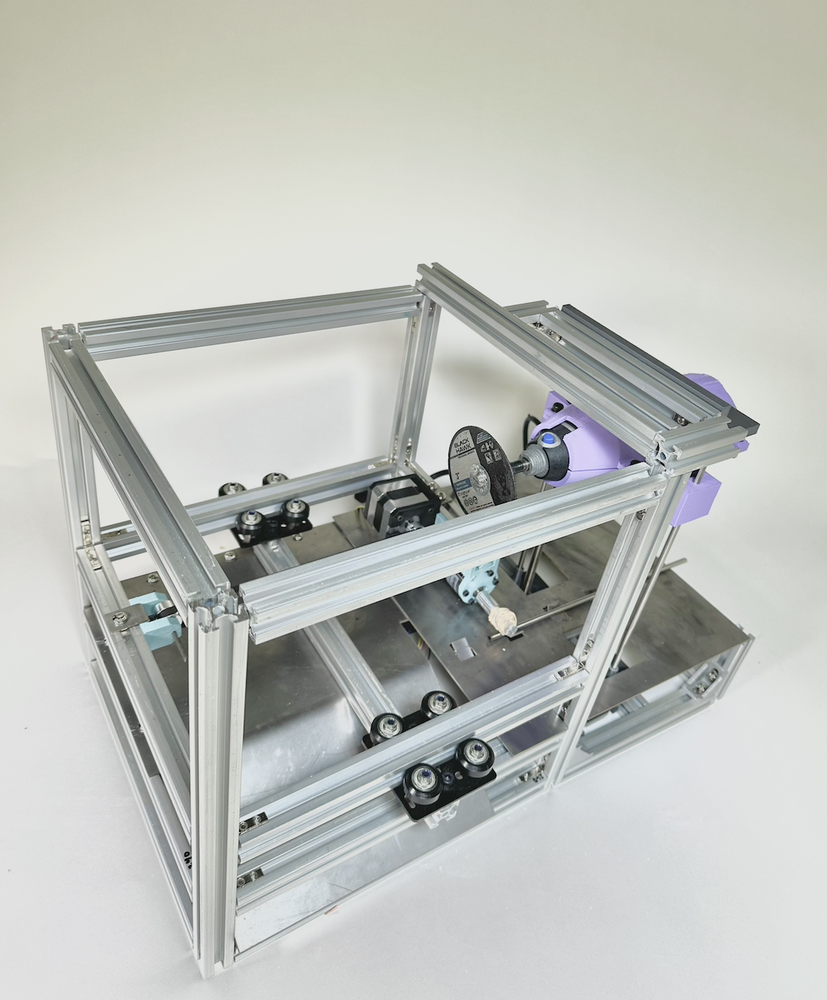

# REEKON 2 Shaft Cutting Device
### By: Darya Clark, Hannah Loly, and Julie Katz

Howdy folks! Welcome to the code base for the REEKON 2 Shaft Cutting Device team. Our device uses a Raspberry Pi 4 and Airtable to use user data to cut stalk sizes of steel rods to the users specific needs. For more information, please contact darya.clark@tufts.edu

