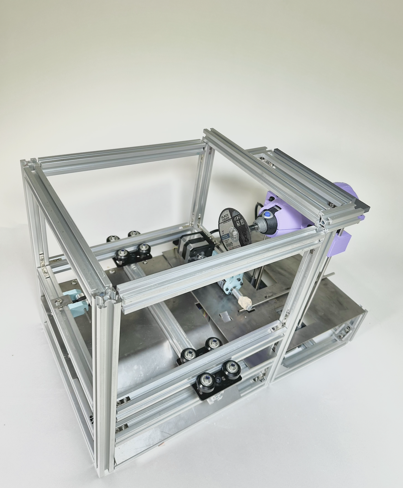
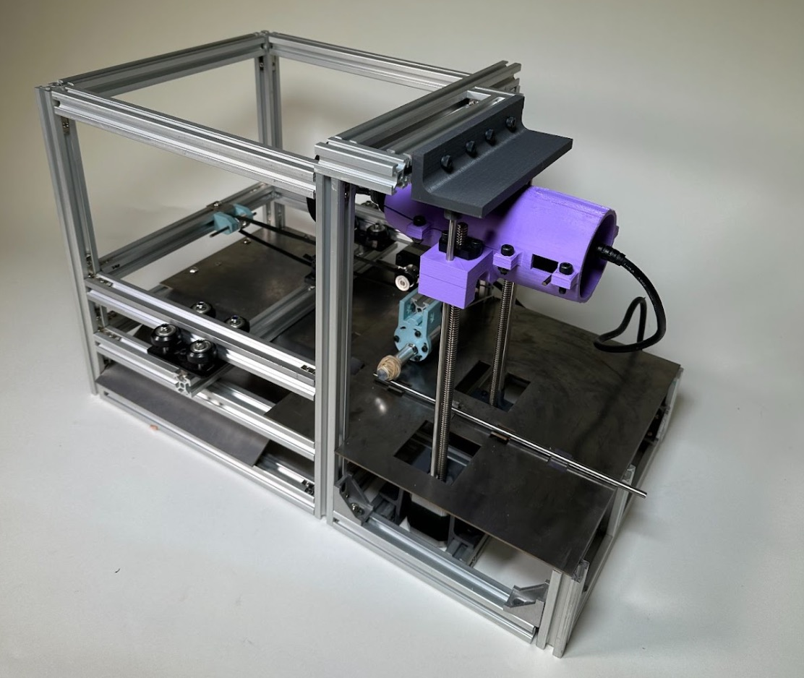
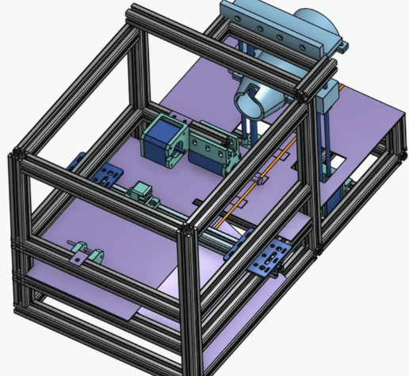
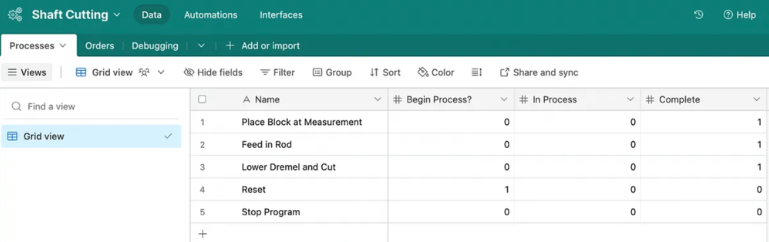
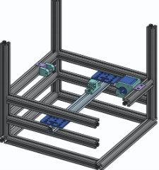
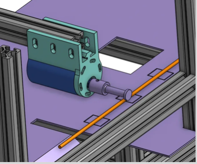

# REEKON 2 Shaft Cutting Device
### By: Darya Clark, Hannah Loly, and Julie Katz

Howdy folks! Welcome to the code base for the REEKON 2 Shaft Cutting Device team. This was a senior design project at Tufts University in Fall of 2023. Our device uses a Raspberry Pi 4 and Airtable to use user data to cut stalk sizes of steel rods of diameters 3 and 6 mm to the users specific needs. For more information, please contact daryaclark@gmail.com

Below is the complete design rendered in OnShape

First, the user inputs their desired length of cut to a survey-style page in Airtable. This begins the shaft cutting process. The steps occur sequentially, and the current place in the process can be seen in the Airtable below with each step's successful completion triggering the next

To measure the total cut length, we used a stepper motor to drive a belt attached to a piece of 8020. When the desired length was reached, a stepper motor with a gripped attachment drove the rod into the block, and the dremel clamped the rod down before cutting

After the cut is performed, the rod falls the bent sheet-metal platform to the custom sheet metal collection tray. A video of the cut process can be seen below

[Full video](https://drive.google.com/file/d/1474lCladpDGj5An06TtTJEMj-hvL-3g2/view)
